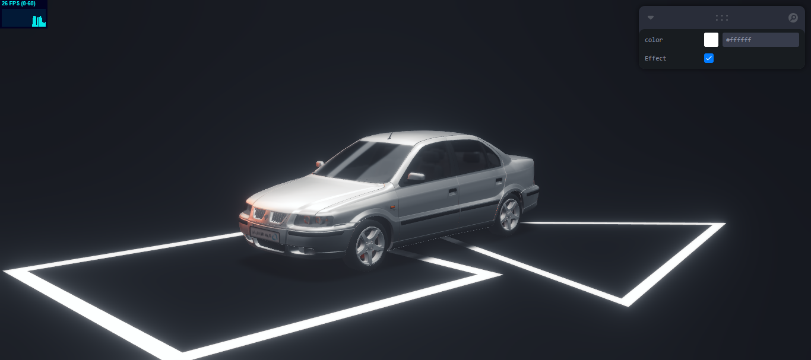

# Samand3DViewer - 3D Samand Viewer


 

A modern 3D model viewer built with React, Three.js, and powerful helper libraries for an immersive 3D experience.

## Features

- 🚀 Lightning-fast rendering with Three.js
- 🎨 Intuitive controls powered by Drei
- ⚙️ Customizable settings via Leva controls
- 📱 Responsive design for all devices
- 🔧 Easy-to-use developer interface


## 🛠️ Technologies Used


## 🚀 Quick Start

1. **Clone the repository**
```bash
git clone https://github.com/your-username/Samand3DViewer.git
cd Samand3DViewer
 ```
2. **Install dependencies**

  ```bash
    npm install
    # or
    yarn
  ```
3. **Start development server**

  ```bash
  npm run dev
  # or
  yarn dev
  ```
3. **Open in browser**
  ```bash
  http://localhost:5173/
  ```

## Contributing

Contributions are welcome! Please follow these steps:

1. Fork the project
2. Create your feature branch (`git checkout -b feature/AmazingFeature`)
3. Commit your changes (`git commit -m 'Add some amazing feature'`)
4. Push to the branch (`git push origin feature/AmazingFeature`)
5. Open a Pull Request

## 📜 License

[](https://opensource.org/licenses/MIT)

This project is licensed under the MIT License - see the LICENSE file for details.

## 📬 Contact

**MohammadReza Sedghi**

[](https://t.me/mr_sedghi)
[](mailto:m.r.sedghii@gmail.com)
[](https://github.com/mrsedghi)

**Project Link**:
https://github.com/mrsedghi/Samand3DViewer

## 🙏 Acknowledgments

Special thanks to these amazing projects:

[](https://threejs.org/)
[](https://github.com/pmndrs/drei)
[](https://github.com/pmndrs/leva)
[](https://vitejs.dev/)

---

<div align="center">
Made with ❤️ using Three.js and React

[](https://github.com/mrsedghi/Samand3DViewer/stargazers)
[](https://github.com/mrsedghi/Samand3DViewer/network/members)
</div>
